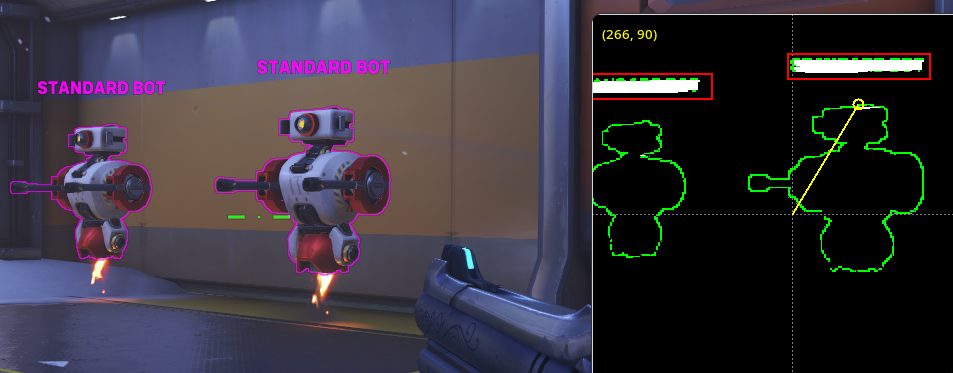

## Overwatch 2 CV aim/flick assist for Linux on Wayland
My exploration of low-latency screen capture and mouse interception on Wayland Linux, which tries its best to make this difficult.



### Details

Uses `wl-screenrec` to capture and feed raw video into v4l2 which is then read by OpenCV. Mouse clicks are intercepted via `evdev` and events are written through `uinput`.

Detection method is fast (>100 FPS) but dumb; edge case aplenty. Goes to shit in noisy scenes. Not much more can be done without more sophisticated models.

Install `wlr-randr` and [`wl-screenrec`](https://github.com/russelltg/wl-screenrec). `evtest` may be of some use discovering your peripheral device.
```sh
$ pip install -r modules
```

`evdev` may require your user be added to the `input` group. Run as user (will prompt for root pass):
```sh
$ python aim.py
```


### Disclaimer
My fine-tuned values have been redacted, and no further instructions will be given on its use. What's left will only be useful to some. Code responsibly, the risk is yours.

The rest of you: your friend in Diamond 5 needs to touch grass. Learn to love low Elo hell.
